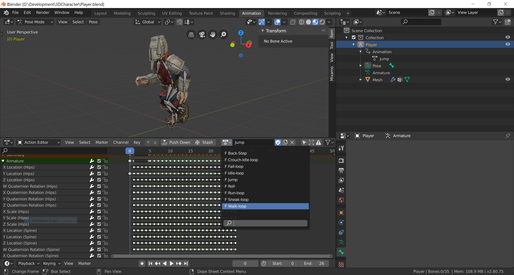

# 3DCharacter

A simple rigged and animated character from [Mixamo](https://www.mixamo.com/) that has been edited to be suitable for use with 3D Game engines such as [Godot](https://godotengine.org/).

## Details

The [`Player.blend`](Player.blend) file has the rigged armature and mesh with several Mixamo animations attached.
These animations have been manually tweaked to have appropriate scaling, and for minor timing and distance adjustments.
Currently, the model includes the following animations;

 * Idle loop
 * Walk loop
 * Run loop
 * Crouch idle loop
 * Sneak loop
 * Fall loop
 * Jump
 * Roll
 * Back step

The source animations are included in the [`Mixamo`](Mixamo) sub-folder, and the [`Mixamo/Standard Walk.fbx`](Mixamo/Standard Walk.fbx) file also includes the character mesh.
